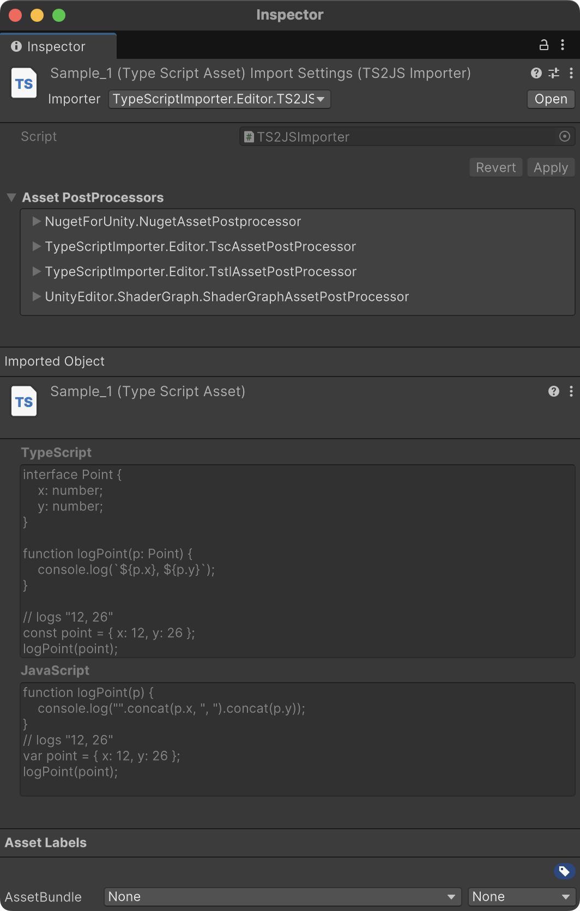

# TypeScript Importer  
TypeScript Importer for Unity  

[](https://github.com/AnnulusGames/TypeScriptImporter/releases)
[](./LICENSE)

English | [日本語](./README_JA.md)

  

## Overview  

TypeScript Importer is a library for integrating TypeScript into Unity. By adding TypeScript Importer to your project, `.ts` files are automatically transpiled into JavaScript and treated as `TypeScriptAsset`.  

Additionally, it provides support for [TypeScriptToLua](https://typescripttolua.github.io/), enabling `.ts` files to be transpiled into Lua instead of JavaScript. For details, refer to the [TypeScriptImporter.Lua](#typescriptimporterlua) section.  

## Setup  

### Requirements  

- Unity 2021.3 or later  

### TypeScript  

If TypeScript is not installed, use the following command to install it:  

> [!WARNING]  
> TypeScript Importer requires TypeScript to be installed globally.  

```plaintext  
npm install -g typescript  
```  

### Unity  

1. Open the Package Manager from `Window > Package Manager`.  
2. Click the "+" button and select "Add package from git URL".  
3. Enter the following URL:  

```
https://github.com/AnnulusGames/TypeScriptImporter.git?path=src/TypeScriptImporter/Assets/TypeScriptImporter
```  

Alternatively, open `Packages/manifest.json` and add the following entry to the `dependencies` block:  

```json  
{
    "dependencies": {
        "com.annulusgames.typescript-importer": "https://github.com/AnnulusGames/TypeScriptImporter.git?path=src/TypeScriptImporter/Assets/TypeScriptImporter"
    }
}
```  

## Usage  

Adding a `.ts` file to the `Assets` folder will trigger automatic compilation by TypeScript Importer, converting it into a `TypeScriptAsset`.  

This asset retains both the original TypeScript source code and the transpiled JavaScript source code as a `ScriptableObject`.  

  

The generated `TypeScriptAsset` can be passed to any JavaScript execution environment. Below is an example using [Jint](https://github.com/sebastienros/jint):  

```ts  
// example.ts
// Place this in the Resources folder

declare function log(message: any): void;

log("hello!");
```  

```cs  
using System;
using UnityEngine;
using TypeScriptImporter;
using Jint;

public class Example : MonoBehaviour
{
    void Start()
    {
        var engine = new Engine()
            .SetValue("log", new Action<object>(Debug.Log));
        
        var asset = Resources.Load<TypeScriptAsset>("example");

        engine.Execute(asset.JavaScriptSource);
    }
}
```  

## Type Definition Files  

TypeScript Importer recognizes `.d.ts` files and converts them into `TypeScriptDeclarationAsset`. This can be used like a `TextAsset` and can also be referenced by other `.ts` files.  

## tsconfig.json  

You can modify the `tsconfig.json` file used by TypeScript Importer from `Project Settings > TypeScript Importer`.  

  

For details on `tsconfig.json`, refer to the [official documentation](https://www.typescriptlang.org/docs/handbook/tsconfig-json.html).  

If no configuration is specified, TypeScript Importer generates a temporary `tsconfig.json` for use.  

## TypeScriptImporter.Lua  

By using TypeScriptImporter.Lua, `.ts` files can be transpiled into Lua instead of JavaScript. TypeScriptImporter.Lua is provided as a separate package and requires additional installation.  

### TypeScriptToLua  

TypeScriptImporter.Lua uses [TypeScriptToLua](https://typescripttolua.github.io/) internally. If TypeScriptToLua is not installed, use the following command to install it:  

> [!WARNING]  
> TypeScriptImporter.Lua requires TypeScriptToLua to be installed globally.  

```plaintext  
npm install -g typescript-to-lua  
```  

### Unity  

1. Open the Package Manager from `Window > Package Manager`.  
2. Click the "+" button and select "Add package from git URL".  
3. Enter the following URL:  

```
https://github.com/AnnulusGames/TypeScriptImporter.git?path=src/TypeScriptImporter/Assets/TypeScriptImporter.Lua
```  

Alternatively, open `Packages/manifest.json` and add the following entry to the `dependencies` block:  

```json  
{
    "dependencies": {
        "com.annulusgames.typescript-importer.lua": "https://github.com/AnnulusGames/TypeScriptImporter.git?path=src/TypeScriptImporter/Assets/TypeScriptImporter.Lua"
    }
}
```  

## TypeScriptToLuaAsset  

To transpile `.ts` files into Lua, switch the active Importer. From the Importer dropdown, select `TypeScriptImporter.Editor.TS2LuaImporter`.  

  

The generated `TypeScriptToLuaAsset` can be passed to any Lua execution environment. Below is an example using [Lua-CSharp](https://github.com/AnnulusGames/Lua-CSharp):  

```ts  
// example.ts
// Place this in the Resources folder

console.log("hello!");
```  

```cs  
using System;
using UnityEngine;
using TypeScriptImporter;
using Lua;

public class Example : MonoBehaviour
{
    async void Start()
    {
        var state = LuaState.Create();

        state.Environment["print"] = new LuaFunction("print", (context, buffer, ct) =>
        {
            Debug.Log(context.GetArgument(0));
            return new(0);
        });

        var asset = Resources.Load<TypeScriptToLuaAsset>("example");

        await state.DoStringAsync(asset.LuaSource, cancellationToken: destroyCancellationToken);
    }
}
```  

To adjust the behavior of TypeScriptToLua, you need to edit `tsconfig.json`. For details, refer to the [TypeScriptToLua documentation](https://typescripttolua.github.io/docs/configuration).  

## License  

[MIT License](LICENSE)  