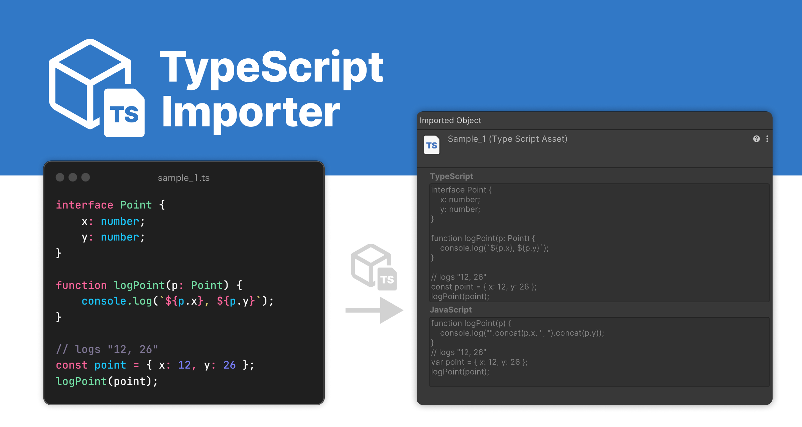
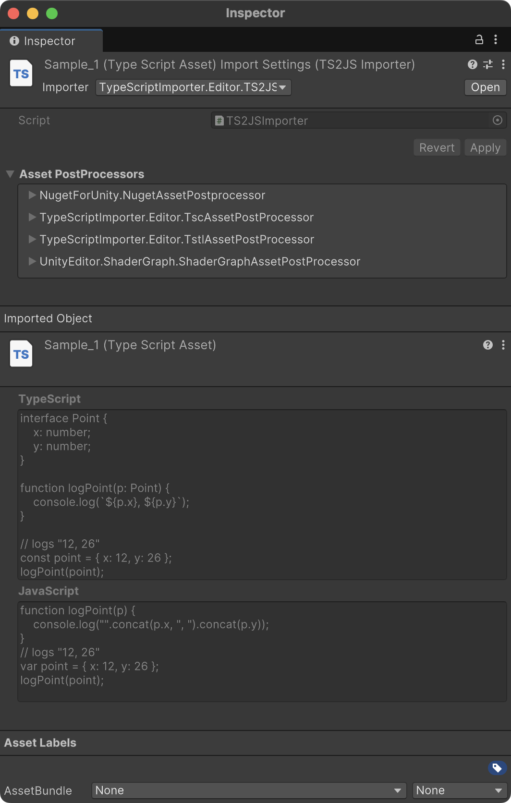
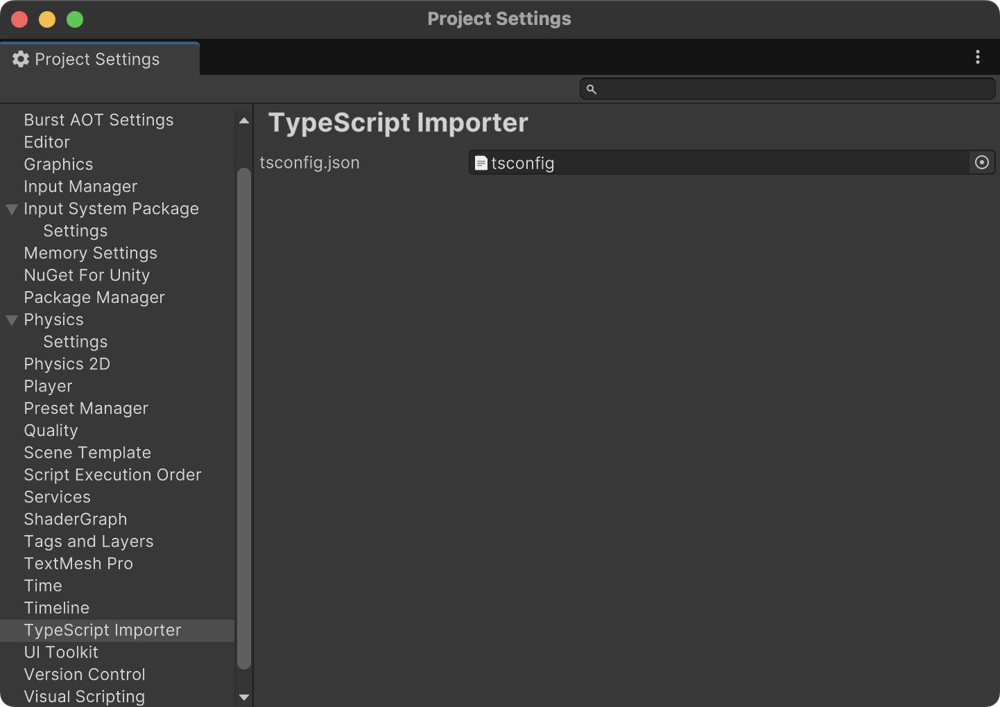
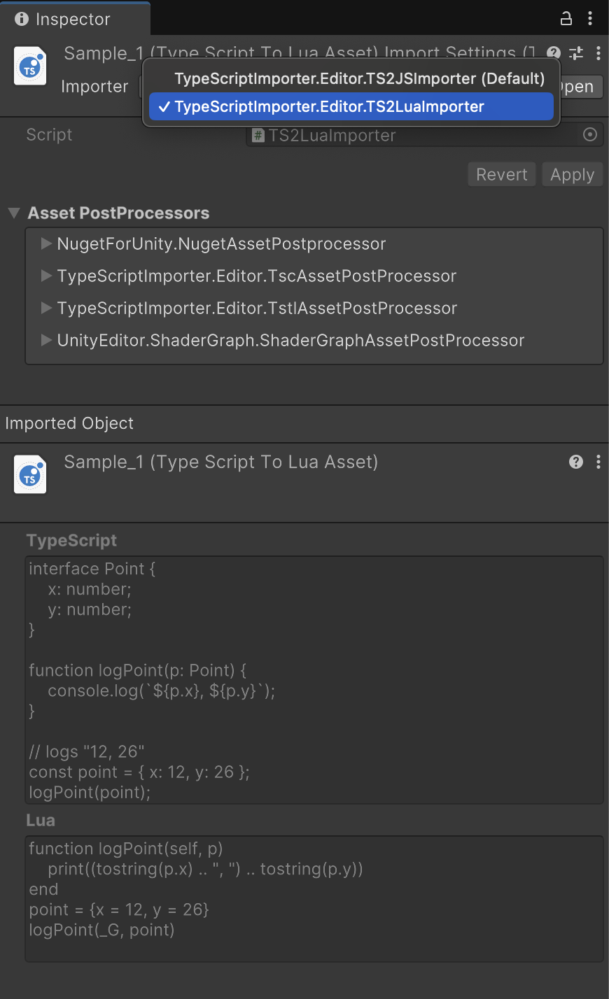

# TypeScript Importer
 TypeScript Importer for Unity

[](https://github.com/AnnulusGames/TypeScriptImporter/releases)
[](./LICENSE)

[English]((./README.md)) | 日本語



## 概要

TypeScript ImporterはUnityにTypeScriptを導入するためのライブラリです。TypeScript Importerをプロジェクトに追加することで、`.ts`が自動でJavaScriptにトランスパイルされ、`TypeScriptAsset`として扱えるようになります。

また、[TypeScriptToLua](https://typescripttolua.github.io/)に対応した拡張も用意されています。これを利用することで、`.ts`をJavaScriptの代わりにLuaにトランスパイルすることが可能になります。詳細は[TypeScriptImporter.Lua](#typescriptimporterlua)の項目を参照してください。

## セットアップ

### 要件

* Unity 2021.3 以上

### TypeScript

TypeScriptがインストールされていない場合は以下のコマンドを実行してTypeScriptをインストールします。

> [!WARNING]
> TypeScript Importerを利用するには、TypeScriptがグローバルにインストールされている必要があります。

```plaintext
npm install -g typescript
```

### Unity

1. Window > Package ManagerからPackage Managerを開く
2. 「+」ボタン > Add package from git URL
3. 以下のURLを入力する

```
https://github.com/AnnulusGames/TypeScriptImporter.git?path=src/TypeScriptImporter/Assets/TypeScriptImporter
```

あるいはPackages/manifest.jsonを開き、dependenciesブロックに以下を追記

```json
{
    "dependencies": {
        "com.annulusgames.typescript-importer": "https://github.com/AnnulusGames/TypeScriptImporter.git?path=src/TypeScriptImporter/Assets/TypeScriptImporter"
    }
}
```

## 使い方

Assetsフォルダ以下に`.ts`ファイルを追加することで、TypeScript Importerによって自動的にコンパイルが実行され、`TypeScriptAsset`に変換されます。

これは元のTypeScriptのソースコードとトランスパイル後のJavaScriptのソースコードの両方を保持するScriptableObjectです。



作成された`TypeScriptAsset`は任意のJavaScriptの実行環境に渡すことができます。以下は[Jint](https://github.com/sebastienros/jint)を用いたサンプルです。

```ts
// example.ts
// これをResourcesフォルダ内に配置

declare function log(message: any): void;

log("hello!")
```

```cs
using System;
using UnityEngine;
using TypeScriptImporter;
using Jint;

public class Example : MonoBehaviour
{
    void Start()
    {
        var engine = new Engine()
            .SetValue("log", new Action<object>(Debug.Log));
        
        var asset = Resources.Load<TypeScriptAsset>("example");

        engine.Execute(asset.JavaScriptSource);
    }
}
```

## 型定義ファイル

TypeScript Importerは`.d.ts`ファイルを認識して`TypeScriptDeclarationAsset`に変換します。これは`TextAsset`のように利用できるほか、他の`.ts`ファイルから参照することが可能です。

## tsconfig.json

`Project Settings > TypeScript Importer`からTypeScript Importerが利用する`tsconfig.json`ファイルを変更することが可能です。



`tsconfig.json`の詳細は[公式ドキュメント](https://www.typescriptlang.org/docs/handbook/tsconfig-json.html)を参照してください。

指定がない場合、TypeScript Importerが一時的な`tscondig.json`を生成して利用します。

## TypeScriptImporter.Lua

TypeScriptImporter.Luaを利用することで、`.ts`をJavaScriptではなくLuaにトランスパイルできます。TypeScriptImporter.Luaは別パッケージとして提供されているため、追加のインストールが必要です。

### TypeScriptToLua

TypeScriptImporter.Luaは内部で[TypeScriptToLua](https://typescripttolua.github.io/)を利用します。TypeScriptToLuaがインストールされていない場合は以下のコマンドを実行してTypeScriptToLuaをインストールします。

> [!WARNING]
> TypeScriptImporter.Luaを利用するには、TypeScriptToLuaがグローバルにインストールされている必要があります。

```plaintext
npm install -g typescript-to-lua
```

### Unity

1. Window > Package ManagerからPackage Managerを開く
2. 「+」ボタン > Add package from git URL
3. 以下のURLを入力する

```
https://github.com/AnnulusGames/TypeScriptImporter.git?path=src/TypeScriptImporter/Assets/TypeScriptImporter.Lua
```

あるいはPackages/manifest.jsonを開き、dependenciesブロックに以下を追記

```json
{
    "dependencies": {
        "com.annulusgames.typescript-importer.lua": "https://github.com/AnnulusGames/TypeScriptImporter.git?path=src/TypeScriptImporter/Assets/TypeScriptImporter.Lua"
    }
}
```

## TypeScriptToLuaAsset

`.ts`ファイルをLuaとしてトランスパイルするには、有効なImporterを切り替える必要があります。Importerのドロップダウンから`TypeScriptImporter.Editor.TS2LuaImporter`を選択します。




作成された`TypeScriptToLuaAsset`は任意のLuaの実行環境に渡すことができます。以下は[Lua-CSharp](https://github.com/AnnulusGames/Lua-CSharp)を用いたサンプルです。

```ts
// example.ts
// これをResourcesフォルダ内に配置

console.log("hello!")
```

```cs
using System;
using UnityEngine;
using TypeScriptImporter;
using Lua;

public class Example : MonoBehaviour
{
    async void Start()
    {
        var state = LuaState.Create();

        state.Environment["print"] = new LuaFunction("print", (context, buffer, ct) =>
        {
            Debug.Log(context.GetArgument(0));
            return new(0);
        });

        var asset = Resources.Load<TypeScriptToLuaAsset>("example");

        await state.DoStringAsync(asset.LuaSource, cancellationToken: destroyCancellationToken);
    }
}
```

TypeScriptToLuaの挙動を調整するには`tsconfig.json`を編集する必要があります。詳細は[TypeScriptToLuaのドキュメント](https://typescripttolua.github.io/docs/configuration)を参照してください。

## ライセンス

[MIT License](LICENSE)